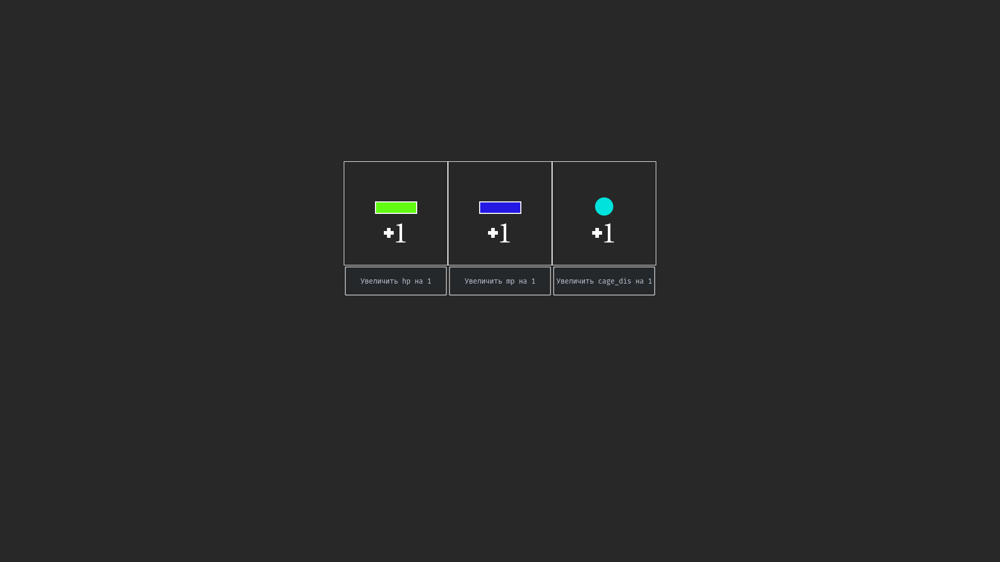

# Trap them (turn-based strategy)

* [Description](#description)
* [Technologies](#technologies)
* [screenshots](#screenshots)

## Description

Turn-based strategy in which the player needs to defeat enemies, but you can only use traps, which can be set for coins.
The character can move through the cells, with this, the number of player actions is limited, but can be increased by increasing the skill.
The player has limited health, if it runs out, the player loses.
Levels will be generated randomly based on difficulty.
Complexity mainly affects the level of AI and the number of enemies.
The game is realized in isometric view. 

## Technologies
pygame, sqlite3, pyqame_gui, pickle, random, collections, sys

## Screenshots

#### Start menu

#### Gameplay (battle)

#### Level up menu

